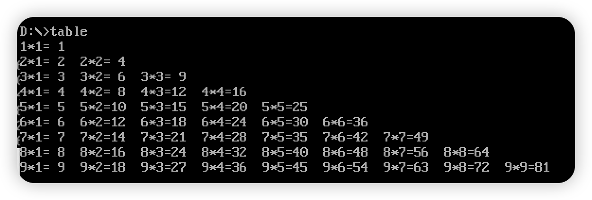
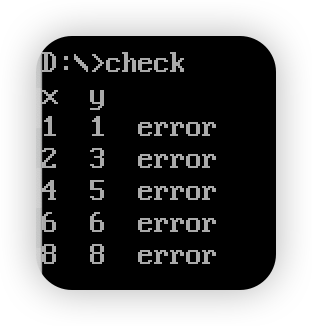

# Assignment 4 Multiplication Table

## 输出九九乘法表

程序结果：



汇编代码：

```
.MODEL SMALL               ; 选择 SMALL 内存模型
.STACK 100h                ; 为栈分配 256 字节

.DATA                      ; 数据段开始
    TMPBUF   DB 3 DUP(0)                           ; 3 字节临时缓冲
    OUTLINE  DB 00H, '*', 00H, '=', 2 DUP(2), '  ', '$' ; “a*b=cc” 模板
    NEWLINE  DB 0DH, 0AH, '$'                      ; CR/LF 结尾的字符串
    RETADR   DW 0000H                              ; 存放返回地址的占位

.CODE                      ; 代码段开始
START:                     ; 程序入口
    MOV AX, @DATA          ; AX = 数据段地址
    MOV DS, AX             ; DS = 数据段，初始化数据段寄存器
    MOV CX, 9              ; 外层循环次数设为 9 行

LOOP1:                     ; 外层：行控制（1..9）
    MOV DH, 0AH            ; DH = 10（十进制）
    SUB DH, CL             ; DH = 10 - CL，当前行最大列值
    MOV DL, 01H            ; DL = 1，列计数从 1 开始
    MOV AL, DH             ; AL 备份当前行上限
    AND AX, 00FFH          ; 清 AX 高字节，保留 AL

LOOP2:                     ; 内层：列控制（1..行）
    CMP DL, DH             ; 是否超过当前行上限？
    JA NEXT                ; 是则换行，进入下一行
    PUSH DX                ; 保存 DX（行/列信息）
    PUSH CX                ; 保存 CX（计数）
    PUSH AX                ; 保存 AX（备份）
    PUSH DX                ; 再保存一份 DX 给子程序使用
    MOV AL, DH             ; AL = 被乘数（行）
    MUL DL                 ; AX = AL * DL（8 位乘法）
    PUSH AX                ; 压入乘积供打印过程使用
    CALL PRINT_LINE        ; 打印一项 “a*b=cc”
    POP CX                 ; 还原 CX
    POP DX                 ; 还原 DX
    INC DL                 ; 列 +1
    JMP LOOP2              ; 继续内层循环

NEXT:                      ; 一行结束换行
    MOV DX, OFFSET NEWLINE ; DX 指向换行字符串
    MOV AH, 09H            ; DOS 21H/09 显示以 '$' 结尾的串
    INT 21H                ; 调用中断输出
    LOOP LOOP1             ; 外层循环减一，若非零跳回 LOOP1
    MOV AH, 4CH            ; 程序返回 DOS
    INT 21H                ; 结束

PRINT_LINE PROC            ; 子程序：格式化并输出一项
    POP RETADR             ; 取回返回地址到 RETADR
    POP DX                 ; 取被乘数/乘数（行/列）到 DX
    MOV AX, DX             ; AX = DX，为除 10 做准备
    MOV BL, 0AH            ; BL = 10
    DIV BL                 ; AL=十位 AH=个位（对 AX 除 10）
    CMP AL, 0              ; 十位是否为 0？
    JZ SKIP_TENS           ; 为 0 则十位显示空格
    ADD AL, 30H            ; 十位转 ASCII
    MOV OUTLINE+4, AL      ; 写入模板的十位位置
    JMP STORE_ONES         ; 跳到存个位

SKIP_TENS:                 ; 十位为 0 的处理
    MOV OUTLINE+4, ' '     ; 十位显示空格

STORE_ONES:                ; 处理个位
    ADD AH, 30H            ; 个位转 ASCII
    MOV OUTLINE+5, AH      ; 写入模板的个位位置
    POP AX                 ; 取右操作数到 AL
    AND AL, 0FH            ; 仅保留低 4 位
    ADD AL, 30H            ; 转 ASCII
    MOV OUTLINE+2, AL      ; 写入模板右操作数
    POP AX                 ; 取左操作数到 AL
    AND AL, 0FH            ; 仅保留低 4 位
    ADD AL, 30H            ; 转 ASCII
    MOV OUTLINE, AL        ; 写入模板左操作数
    MOV DX, OFFSET OUTLINE ; DX 指向整行模板
    MOV AH, 09H            ; DOS 21H/09 显示字符串
    INT 21H                ; 输出 “a*b=cc”
    PUSH RETADR            ; 压回返回地址
    RET                    ; 返回调用点

PRINT_LINE ENDP            ; 子程序结束

END START                  ; 程序入口标签 START
```

**过程调用的实现**：`PRINT_LINE` 展示了如何用子程序完成相对独立的工作，流程为：

* 主循环算出乘积后，把所需值压栈并调用 `PRINT_LINE`。
* 进入过程后按入栈相反顺序 `POP` 恢复数据（栈为后进先出）。
* 在过程内完成格式拼装与判断，然后输出到屏幕。
* 最后以 `RET` 返回，主循环继续下一项。

整个过程中，`PUSH`/`POP` 既用于传递数据，也用于保证调用前后的寄存器现场一致，使主程序与子程序互不干扰，更便于维护。

**寄存器与参数传递**：本例没有显式参数列表，数据通过寄存器配合栈来传递。乘法结果在 `AX`，而诸如 `CX`、`DX` 的上下文通过入栈/出栈保存与恢复。子过程按需从栈取值并处理，最后返回并完成显示；栈充当了短暂的交换区，避免过程间相互影响。

**结构化设计**：计算与显示被清晰拆分：主程序负责数值计算，`PRINT_LINE` 专注格式化与输出。这样的抽象减少重复代码，提升可读性与可维护性。

## 九九乘法表纠错

程序执行结果：



汇编代码如下：

```
.MODEL SMALL               ; SMALL 内存模型
.STACK 100h                ; 栈 256 字节

.DATA                      ; 数据段
    mulTable db 7,2,3,4,5,6,7,8,9            ; 行 1 期望（含错）
             db 2,4,7,8,10,12,14,16,18       ; 行 2 期望（含错）
             db 3,6,9,12,15,18,21,24,27      ; 行 3 期望
             db 4,8,12,16,7,24,28,32,36      ; 行 4 期望（含错）
             db 5,10,15,20,25,30,35,40,45    ; 行 5 期望
             db 6,12,18,24,30,7,42,48,54     ; 行 6 期望（含错）
             db 7,14,21,28,35,42,49,56,63    ; 行 7 期望
             db 8,16,24,32,40,48,56,7,72     ; 行 8 期望（含错）
             db 9,18,27,36,45,54,63,72,81    ; 行 9 期望
    hdr     db "x  y", 0DH, 0AH, '$'        ; 标题并换行
    gap     db "  ", '$'                    ; 两空格分隔
    errmsg  db "  error", 0DH, 0AH, '$'     ; 错误提示并换行
    newline db 0DH, 0AH, '$'                 ; CR/LF 字符串

.CODE                      ; 代码段
START:                     ; 入口
    MOV    AX, @DATA        ; AX = 数据段地址
    MOV    DS, AX           ; DS 初始化
    LEA    DX, hdr          ; DX = 标题地址
    MOV    AH, 09H          ; 21H/09 打印串
    INT    21H              ; 调用中断
    MOV    CX, 9            ; 外循环 9 行
    MOV    AX, 1            ; AX 作为乘数（行）
    MOV    SI, 0            ; SI 指向表起始

A_LOOP:                    ; 外层循环开始
    PUSH   CX               ; 保存外层计数
    PUSH   AX               ; 保存当前乘数
    MOV    BX, 1            ; BX = 被乘数（列）
    MOV    CX, 9            ; 内层计数 9 次

B_LOOP:                    ; 内层循环开始
    XOR    DX, DX           ; 清 DX
    MOV    DL, mulTable[SI] ; DL = 期望值
    MUL    BL               ; AX = AX * BL
    CMP    AX, DX           ; 比较计算与期望
    JNE    OUTPUT_ERR       ; 不等则输出错误
    JMP    CONTINUE         ; 相等则继续

OUTPUT_ERR:                ; 错误输出分支
    POP    DX               ; 取回保存的 AX（低位到 DX）
    PUSH   DX               ; 立刻再保存，保持栈平衡
    MOV    AL, DL           ; AL = 期望值（个位）
    ADD    AL, 30H          ; 转 ASCII
    MOV    AH, 02H          ; 21H/02 输出字符
    MOV    DL, AL           ; DL = 字符
    INT    21H              ; 打印期望值
    LEA    DX, gap          ; DX = 两空格
    MOV    AH, 09H          ; 21H/09 输出串
    INT    21H              ; 打印分隔
    MOV    AL, BL           ; AL = 列（被乘数）
    ADD    AL, 30H          ; 转 ASCII
    MOV    DL, AL           ; DL = 字符
    MOV    AH, 02H          ; 21H/02 输出字符
    INT    21H              ; 打印列
    LEA    DX, errmsg       ; DX = "  error"
    MOV    AH, 09H          ; 21H/09 输出串
    INT    21H              ; 打印错误提示

CONTINUE:                  ; 内层通用收尾
    POP    AX               ; 还原 AX（乘数）
    PUSH   AX               ; 再保存以供下次使用
    INC    BX               ; 列 +1
    INC    SI               ; 表索引 +1
    LOOP   B_LOOP           ; 继续内层循环
    POP    AX               ; 结束内层后取回 AX
    INC    AX               ; 行 +1
    POP    CX               ; 取回外层计数
    LOOP   A_LOOP           ; 继续外层循环
    MOV    AH, 4CH          ; 返回 DOS
    INT    21H              ; 结束

END START                  ; 程序结束
```

通过完成这次九九乘法表纠错程序，我更直观地理解了汇编中的“过程调用”机制。高级语言里的 `call/return`，在这里以寄存器的保存与恢复来达成；代码大量使用 `PUSH`/`POP` 管理现场，确保不同循环层级之间互不干扰。

数据传递与运算主要依赖寄存器：用 `MUL` 执行乘法，用 `CMP` 核对与表中期望是否一致，这与高级语言的函数返回与条件判断相呼应。表格数据按索引访存，再与寄存器结果逐项对照，体现了底层对数据流的精细控制。

综合来看，借助寄存器管理、条件跳转与过程分工，可以在汇编层面实现清晰的模块化结构。这既加深了我对执行模型的理解，也让我意识到在低级语言中对细节的把控尤为关键。