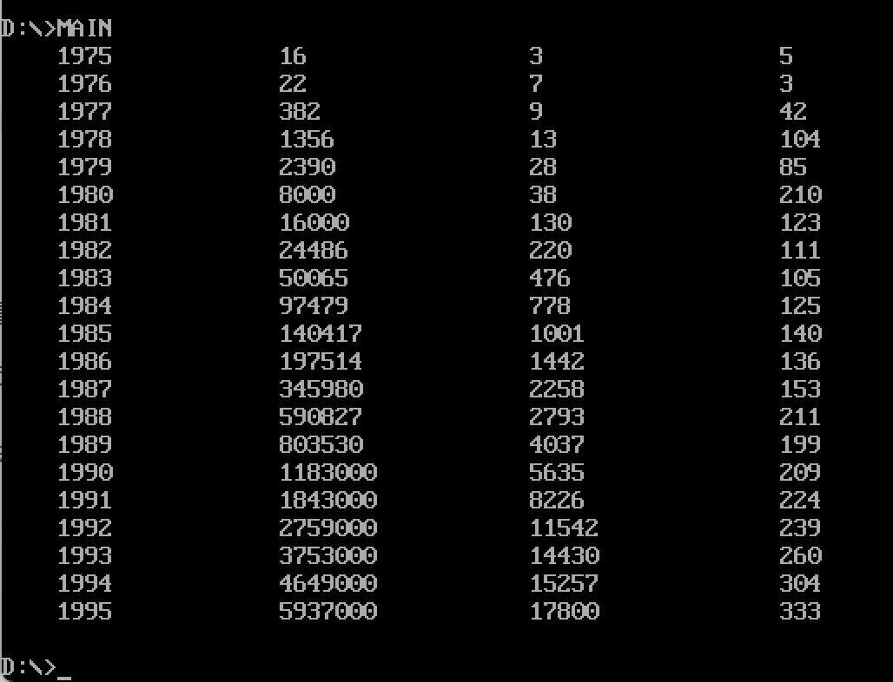

# 汇编项目：薪资统计与表格输出

本仓库演示如何用 MASM 将多个汇编模块协作，完成数据加工与终端输出。项目分为主流程与工具库两部分：
- 主程序（`MAIN.ASM`）负责数据组织、计算与打印
- 工具例程（`UTILS.ASM`）提供数字显示、制表与换行

## 构建与链接

使用 MASM 进行编译，随后链接生成可执行文件：

```
MASM MAIN.ASM
MASM UTILS.ASM
LINK MAIN.OBJ UTILS.OBJ
```

说明：
- `MAIN.ASM` 与 `UTILS.ASM` 分别编译为 `MAIN.OBJ`、`UTILS.OBJ`
- 通过 `LINK` 合并目标文件并解析跨模块符号
- 在主程序中以 `EXTRN DISPLAY_NUMBER: FAR, DISPLAY_TAB: FAR, DISPLAY_NEWLINE: FAR` 声明外部过程；在工具文件中用 `PUBLIC` 导出过程供其它模块调用

## 运行效果

见示意图：



## 主模块概览（`MAIN.ASM`）

主模块包含四个关键步骤：
1. 段初始化：设置数据段（年份、收入、员工数）与目标表段；准备堆栈
2. 数据写表：按行布局，把年份、收入（双字）、员工数（字）写入 `TABLE` 段固定位置
3. 计算平均：以每年收入除以员工数获得人均收入（保留16位商）并写回表
4. 打印输出：遍历表行，按列调用显示例程输出年份、收入、员工数与平均，并做对齐与换行

示例片段（注：代码已在源文件内详细注释）：

```
; 段假设与外部过程声明
ASSUME CS: CODESEG, DS: DATASEG, ES: TABLE
EXTRN DISPLAY_NUMBER: FAR, DISPLAY_TAB: FAR, DISPLAY_NEWLINE: FAR

; 写入与打印逻辑见 MAIN.ASM
```

要点：
- 年份以 4 字节 ASCII 存储；收入为 32 位；员工数为 16 位
- 表行采用固定宽度，便于按偏移写入与读取
- 打印阶段切换 DS 指向 `TABLE`，逐列取值并调用工具例程进行格式化输出

## 工具模块概览（`UTILS.ASM`）

包含三个公共过程：
- `DISPLAY_NUMBER`：将 DX:AX 的数值以十进制输出，并在右侧补空格至固定宽度
- `DIVIDE_DOUBLEWORD`：支持以 CX 为除数对 32 位（DX:AX）进行除法，返回商与余数
- `DISPLAY_TAB` / `DISPLAY_NEWLINE`：输出对齐空格与换行（CRLF）

核心思路：
- 数字显示通过反复除以 10 收集各位并逆序输出
- 使用 DOS 中断 `INT 21H` 的字符输出功能
- 所有过程在入口/出口处保存与恢复调用者寄存器，保证可重入与模块协作

