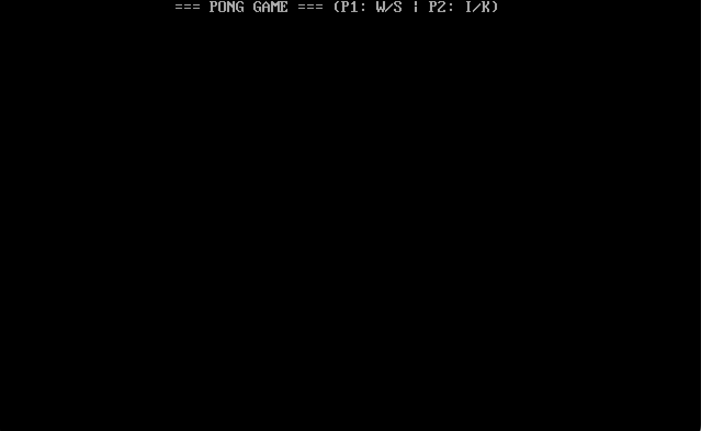
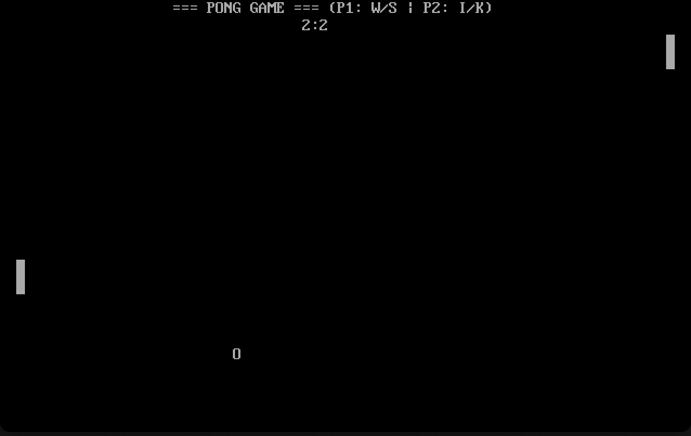
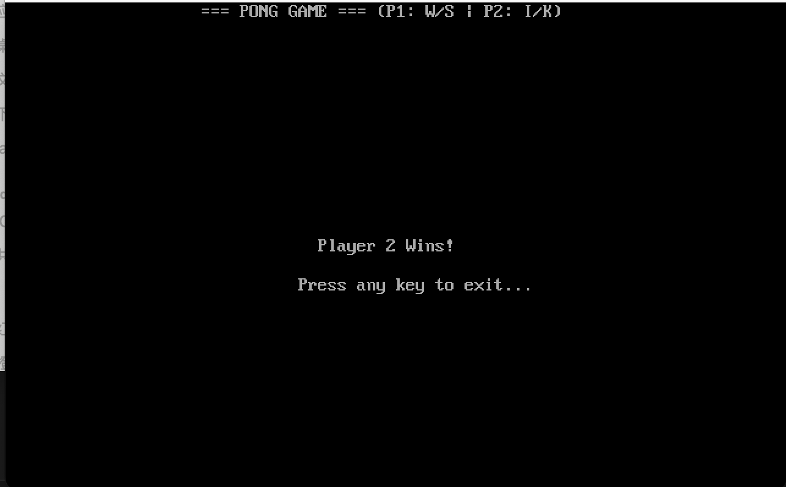

# Pong 双人对战游戏（含TSR & 时钟中断演示）——项目说明文档

**学号：2351493**  
**姓名：胡浩杰**

---







## 一、项目概述

### 1.1 项目名称

**Pong 双人对战游戏**

基于 **8086 汇编语言** 和 **DOS 文本模式** 实现的经典 Pong 双人乒乓球游戏，同时集成了 **TSR（常驻内存程序）** 与 **INT 1Ch 时钟中断** 的演示：游戏退出后，仍有一个在右上角旋转的光标由中断例程驱动。

### 1.2 开发环境

- 汇编器：**MASM 5.0 (Microsoft Macro Assembler)**
- 链接器：**Microsoft Overlay Linker 3.60**
- 运行环境：**DOSBox 0.74-3**（macOS/Windows/Linux）
- 开发平台：**macOS**
- 调试工具：DOSBox 内置调试器

### 1.3 游戏规则与操作方式

- 游戏模式：**双人实时对战**  
- 控制方式：
  - 玩家1（左侧球拍）：`W` 上移，`S` 下移
  - 玩家2（右侧球拍）：`I` 上移，`K` 下移
  - `P`：暂停 / 继续（暂停时前台停住，但后台时钟中断仍在运行）
  - `ESC`：随时退出游戏并**驻留内存（TSR）**
- 计分规则：
  - 球从左侧飞出（`ball_x ≤ 0`）：右边玩家（P2）得 1 分
  - 球从右侧飞出（`ball_x ≥ 79`）：左边玩家（P1）得 1 分
  - 先得到 **3 分** 的玩家获胜（`win_score = 3`）
- 胜负显示：
  - P1 获胜：显示 `Player 1 Wins!`
  - P2 获胜：显示 `Player 2 Wins!`
  - 胜利信息居中显示在屏幕中部
- TSR & 中断效果：
  - 屏幕右上角有一个“旋转光标”字符（`| / - \`），由 INT 1Ch 时钟中断周期性刷新；
  - 即使游戏暂停或者退出到 DOS，旋转光标仍然在右上角转动，说明程序的一部分代码仍驻留在内存并接管了中断。

---

## 二、程序设计与代码介绍

### 2.1 屏幕坐标与界面布局

游戏运行在 80×25 文本模式下：

- 左上角坐标为 `(0,0)`，右下角为 `(79,24)`。
- 本程序布局示意：

```text
(0,0)                    (79,0)
  ┌─────────────────────────┐
  │ === PONG GAME === ...  │ 第0行：标题栏
  ├─────────────────────────┤
  │          0:0           │ 第1行：分数栏 (P1:P2)
  ├─────────────────────────┤
  │█                       █│ 
  │█        O              █│ 游戏区域：第 2~23 行
  │█                       █│ 左右两侧为球拍，中间为球
  │                         │
(0,24)                  (79,24)
```

- 左侧球拍固定在 `X = p1_x = 2`
- 右侧球拍固定在 `X = p2_x = 77`
- 球拍高度固定为 `p1_height = p2_height = 5`
- 球初始位置为 `(ball_x, ball_y) = (40, 12)`，大致在中间

### 2.2 数据结构与变量设计（.data 段）

数据段 `.data` 中的关键变量如下（与 `pong.asm` 一致）：

```text
偏移    变量名          类型  说明
-------------------------------------------
+0000h  field_width     DB    场地宽度(78)
+0001h  field_height    DB    场地高度(23)
+0002h  ball_x          DB    球 X 坐标(0-79)
+0003h  ball_y          DB    球 Y 坐标(0-24)
+0004h  ball_dx         DB    球 X 速度：1 向右，-1 向左
+0005h  ball_dy         DB    球 Y 速度：1 向下，-1 向上
+0006h  p1_x            DB    玩家1 球拍 X 坐标(2)
+0007h  p1_y            DB    玩家1 球拍顶端 Y 坐标
+0008h  p1_height       DB    玩家1 球拍高度(5)
+0009h  p1_score        DB    玩家1 分数
+000Ah  p2_x            DB    玩家2 球拍 X 坐标(77)
+000Bh  p2_y            DB    玩家2 球拍顶端 Y 坐标
+000Ch  p2_height       DB    玩家2 球拍高度(5)
+000Dh  p2_score        DB    玩家2 分数
+000Eh  win_score       DB    获胜分数(3)
```

字符和提示字符串：

- `char_ball = 'O'`：球的显示字符
- `char_paddle = 219`：球拍字符（实心方块）
- `msg_title`：`"=== PONG GAME === (P: Pause | ESC: Quit)$"`
- `msg_p1_win` / `msg_p2_win`：胜利提示（以 `$` 结尾）
- `msg_pause`：`"*** GAME PAUSED - Press any key ***$"`
- `msg_tsr_info`：`"TSR Installed. Bye!$"`

### 2.3 TSR 相关变量（.code 段）

由于中断发生时 DS 可能指向其他程序的数据段，TSR 所需变量统一放在 `.code` 段：

```asm
tsr_old1c_off   dw 0        ; 保存旧 INT 1Ch 偏移
tsr_old1c_seg   dw 0        ; 保存旧 INT 1Ch 段地址
tsr_spin_idx    db 0        ; 旋转动画索引 0~3
tsr_spin_chars  db '|/-\\'   ; 旋转字符表
```

---

## 三、整体流程与模块划分

### 3.1 主程序流程（main）

`main` 过程的主要步骤：

1. 初始化数据段寄存器 DS：

   ```asm
   mov ax, @data
   mov ds, ax
   ```

2. 安装自定义中断处理程序，接管 INT 1Ch：

   ```asm
   call install_interrupt_handler
   ```

3. 设置 80×25 文本模式，隐藏光标，显示标题：

   ```asm
   mov ax, 0003h
   int 10h

   call hide_cursor

   mov dh, 0
   mov dl, 20
   call set_cursor
   lea dx, msg_title
   mov ah, 9
   int 21h
   ```

4. 等待任意键开始游戏：

   ```asm
   mov ah, 0
   int 16h
   ```

5. 进入游戏主循环 `game_loop`：

   ```asm
   game_loop:
       call check_input     ; 处理输入（W/S/I/K, P, ESC）
       call update_ball     ; 更新球坐标与碰撞/得分
       call draw_game       ; 绘制当前帧画面
       call delay           ; 延时控制速度

       mov al, p1_score
       cmp al, win_score
       je  p1_wins

       mov al, p2_score
       cmp al, win_score
       je  p2_wins

       jmp game_loop
   ```

6. 玩家获胜后，显示胜利信息并退出驻留：

   ```asm
   p1_wins:
       call show_win_msg
       lea dx, msg_p1_win
       jmp show_winner_text

   p2_wins:
       call show_win_msg
       lea dx, msg_p2_win

   show_winner_text:
       mov ah, 9
       int 21h
       jmp exit_to_tsr
   ```

7. 在 `exit_to_tsr` 中重新设置文本模式、打印 TSR 提示，并通过 `do_keep_resident` 调用 DOS 31h 终止并驻留。

### 3.2 模块划分与调用关系

主要过程/子程序：

- 输入与控制：
  - `check_input`：键盘输入检测，处理 W/S/I/K、P、ESC
  - `pause_game`：暂停提示 + 阻塞等待任意键
- 游戏逻辑：
  - `update_ball`：球移动、墙壁碰撞、球拍碰撞、得分判断
  - `reset_ball`：得分后重置球位置和方向
- 绘图与显示：
  - `draw_game`：整帧刷新分数、球拍、球
  - `clear_screen_fast`：利用 INT 10h 卷屏功能清屏
  - `set_cursor`：设置光标位置
  - `print_char`：打印单个字符
  - `hide_cursor`：隐藏文本模式光标
  - `show_win_msg`：胜利时清屏并居中光标
- 速度控制：
  - `delay`：双重循环实现固定延时
- TSR 与中断：
  - `timer_handler`：INT 1Ch 时钟中断服务例程（右上角旋转光标）
  - `install_interrupt_handler`：挂接 INT 1Ch（保存原向量 + 设置新向量）
  - `do_keep_resident`：计算需要驻留的段落数并调用 DOS 31h 终止并驻留

调用关系示意：

```text
main
 ├─ install_interrupt_handler
 ├─ hide_cursor
 ├─ set_cursor
 ├─ game_loop
 │   ├─ check_input
 │   │   ├─ pause_game
 │   │   └─ exit_to_tsr
 │   ├─ update_ball
 │   │   ├─ reset_ball
 │   │   └─ 碰撞/得分判定
 │   ├─ draw_game
 │   │   ├─ clear_screen_fast
 │   │   ├─ set_cursor
 │   │   └─ print_char
 │   └─ delay
 ├─ show_win_msg
 ├─ clear_screen_fast
 ├─ print_char
 ├─ hide_cursor
 ├─ install_interrupt_handler
 │   └─ timer_handler (INT 1Ch)
 └─ exit_to_tsr
     └─ do_keep_resident
```

---

## 四、关键算法与实现细节

### 4.1 球移动与碰撞检测（AABB 思想）

`update_ball` 负责球的运动和碰撞处理。

1. **更新球坐标**：

   ```asm
   mov al, ball_x
   add al, ball_dx
   mov ball_x, al

   mov al, ball_y
   add al, ball_dy
   mov ball_y, al
   ```

2. **墙壁碰撞 (Y 轴)**：上方为第 2 行，下方为 `field_height`：

   ```asm
   cmp ball_y, 2
   jle bounce_y
   mov al, ball_y
   cmp al, field_height
   jge bounce_y
   jmp check_paddles
   bounce_y:
      neg ball_dy            ; 反转 Y 方向
      mov al, ball_y
      add al, ball_dy        ; 轻微回退一格，避免“卡墙”
      mov ball_y, al

3. **与 P1 球拍的碰撞**（X 范围在 1~3）：


   ```asm
   check_paddles:
       cmp ball_x, 3
       jg check_p2            ; 不在左侧范围
       cmp ball_x, 1
       jl score_check         ; 已经漏过去 → 可能得分

       mov al, ball_y
       cmp al, p1_y
       jl score_check
       mov bl, p1_y
       add bl, p1_height
       cmp al, bl
       jg score_check

       mov ball_dx, 1         ; 击中球拍，向右反弹
       jmp update_ret
   ```

4. **与 P2 球拍的碰撞**（X 范围在 76~78）：

   ```asm
   check_p2:
       cmp ball_x, 76
       jl update_ret
       cmp ball_x, 78
       jg score_check

       mov al, ball_y
       cmp al, p2_y
       jl score_check
       mov bl, p2_y
       add bl, p2_height
       cmp al, bl
       jg score_check

       mov ball_dx, -1        ; 击中球拍，向左反弹
       jmp update_ret
   ```

5. **得分判定与重置**：

   ```asm
   score_check:
       cmp ball_x, 0
       jle p2_sc              ; 左侧出界，P2 得分
       cmp ball_x, 79
       jge p1_sc              ; 右侧出界，P1 得分
       jmp update_ret
   
   p1_sc:
       inc p1_score
       call reset_ball
       jmp update_ret
   
   p2_sc:
       inc p2_score
       call reset_ball
   ```

**重置球 `reset_ball`**：

```asm
   reset_ball proc
       mov ball_x, 40        ; 中心 X
       mov ball_y, 12        ; 中心 Y
       neg ball_dx           ; 改变发球方向，向失分一方发球
       ret
   reset_ball endp
```

本质上球拍和球都是“轴对齐矩形/点”的简单覆盖检测，可以视为 AABB（Axis-Aligned Bounding Box）的一维简化版本。

### 4.2 键盘输入、暂停与退出

`check_input` 使用 INT 16h 的非阻塞检测读取键盘，避免所有帧都被键盘阻塞。

核心流程：

```asm
   check_input proc
       push ax

       mov ah, 01h
       int 16h
       jz  input_done            ; 无按键直接返回

       mov ah, 00h
       int 16h                    ; AL 中为 ASCII

       cmp al, 27                 ; ESC
       je  exit_jump

       or  al, 20h                ; 转成小写

       cmp al, 'p'
       je  do_pause               ; 暂停

       cmp al, 'w'
       je  p1_up
       cmp al, 's'
       je  p1_down
       cmp al, 'i'
       je  p2_up
       cmp al, 'k'
       je  p2_down
       jmp input_done

   do_pause:
       call pause_game
       jmp  input_done

   exit_jump:
       jmp  exit_to_tsr
```

`pause_game` 通过打印提示并阻塞等待任意键实现暂停：

```asm
   pause_game proc
       push ax
       push dx

       mov dh, 12
       mov dl, 24
       call set_cursor
       lea dx, msg_pause
       mov ah, 9
       int 21h                    ; 显示暂停提示

       mov ah, 0
       int 16h                    ; 阻塞等待按键

       pop dx
       pop ax
       ret
   pause_game endp
```

暂停期间主循环不再运行，但 INT 1Ch 中断仍然触发 `timer_handler`，旋转光标继续转动，实现“前台暂停、后台中断仍在运行”的效果。

### 4.3 绘图与显示系统

`draw_game` 每帧进行完整重绘：

1. **快速清屏**（1~24 行）：

   ```asm
   call clear_screen_fast
   ```

   其内部使用 INT 10h 卷屏功能：

   ```asm
   clear_screen_fast proc
       push ax
       push bx
       push cx
       push dx
       mov ax, 0600h      ; AH=06h 卷屏，AL=0 表示清屏
       mov bh, 07h        ; 黑底白字
       mov cx, 0100h      ; 左上角 (1,0)
       mov dx, 184Fh      ; 右下角 (24,79)
       int 10h
       pop dx
       pop cx
       pop bx
       pop ax
       ret
   clear_screen_fast endp
   ```

2. **绘制分数**：

   ```asm
   mov dh, 1          ; 第 1 行
   mov dl, 35         ; 大致居中
   call set_cursor
   mov al, p1_score
   add al, '0'
   call print_char
   mov al, ':'
   call print_char
   mov al, p2_score
   add al, '0'
   call print_char
   ```

3. **绘制两侧球拍**（使用高度计数循环）：

   ```asm
   ; 绘制玩家1球拍
   mov bl, p1_height
   mov bh, 0
   dp1:
       mov dh, p1_y
       add dh, bh
       mov dl, p1_x
       call set_cursor
       mov al, char_paddle
       call print_char
       inc bh
       dec bl
       jnz dp1

   ; 绘制玩家2球拍
   mov bl, p2_height
   mov bh, 0
   dp2:
       mov dh, p2_y
       add dh, bh
       mov dl, p2_x
       call set_cursor
       mov al, char_paddle
       call print_char
       inc bh
       dec bl
       jnz dp2
   ```

4. **绘制球**：

   ```asm
   mov dh, ball_y
   mov dl, ball_x
   call set_cursor
   mov al, char_ball
   call print_char
   ```

基础显示子程序全部通过 INT 10h 实现：

```asm
   set_cursor proc
       mov ah, 2
       mov bh, 0
       int 10h
       ret
   set_cursor endp

   print_char proc
       mov ah, 0Eh
       mov bh, 0
       int 10h
       ret
   print_char endp

   hide_cursor proc
       mov ah, 1
       mov ch, 32         ; 超出范围隐藏
       int 10h
       ret
   hide_cursor endp
```

### 4.4 延时控制

`delay` 子程序通过双重循环提供固定帧间隔：

```asm
   delay proc
       push cx
       push dx
       mov cx, 2

   outer_loop:
       mov dx, 10000
   inner_loop:
       dec dx
       jnz inner_loop
       loop outer_loop

       pop dx
       pop cx
       ret
   delay endp
```

调整 `cx` / `dx` 的初始值即可改变游戏速度。

---

## 五、TSR 与 INT 1Ch 时钟中断机制

### 5.1 Timer Handler：旋转光标

`timer_handler` 是新的 INT 1Ch 中断服务例程，每秒约执行 18.2 次，在右上角显示旋转光标：

```asm
   timer_handler proc far
       push ax
       push bx
       push ds
       push es
       push di
       pushf

       push cs
       pop  ds          ; DS = CS 访问代码段变量

       mov ax, 0B800h
       mov es, ax       ; 彩色文本模式显存段
       mov di, 158      ; 第0行第79列，79*2 = 158

       mov al, tsr_spin_idx
       and al, 3
       mov bx, offset tsr_spin_chars
       xlat             ; AL = tsr_spin_chars[AL]

       mov ah, 0CFh     ; 闪烁红底，亮白字
       stosw            ; 写入字符+属性

       inc tsr_spin_idx

       popf
       pop di
       pop es
       pop ds
       pop bx
       pop ax

       jmp dword ptr cs:[tsr_old1c_off]  ; 链接原 INT 1Ch
   timer_handler endp
```

### 5.2 中断安装与退出驻留

安装过程 `install_interrupt_handler`：

```asm
   install_interrupt_handler proc
       push ax
       push bx
       push dx
       push ds
       push es

       mov ax, 351Ch      ; 35h: 获取 1Ch 中断向量
       int 21h            ; ES:BX = 原向量
       mov word ptr cs:[tsr_old1c_seg], es
       mov word ptr cs:[tsr_old1c_off], bx

       push cs
       pop  ds
       mov dx, offset timer_handler
       mov ax, 251Ch      ; 25h: 设置 1Ch 中断向量
       int 21h

       pop es
       pop ds
       pop dx
       pop bx
       pop ax
       ret
   install_interrupt_handler endp
```

退出并驻留 `do_keep_resident`：

```asm
   do_keep_resident label near
       mov dx, offset resident_end
       mov cl, 4
       shr dx, cl          ; 字节数 → 段落数
       add dx, 11h         ; PSP(10h) + 1 段安全空间

       mov ax, 3100h       ; 31h: 结束并驻留
       int 21h

   resident_end label byte
```

`exit_to_tsr` 在结束游戏或按 ESC 时统一调用：

```asm
   exit_to_tsr:
       mov ax, 0003h
       int 10h

       lea dx, msg_tsr_info
       mov ah, 9
       int 21h

       jmp do_keep_resident
```

---

## 六、开发流程与调试过程

1. **基础框架搭建**  
   先实现最小骨架：仅设置文本模式、打印标题、退出。确认 MASM 编译、LINK 链接、DOSBox 运行流程无误。

2. **游戏核心逻辑实现**  
   增加 `.data` 段中的球、球拍、分数等变量；实现 `draw_game` 显示静态球拍和球；实现简化版 `update_ball` 只让球沿直线移动，再逐步加入墙壁碰撞、球拍碰撞和得分判定。

3. **输入与控制加入**  
   实现 `check_input` 的非阻塞键盘检测逻辑，确认 W/S/I/K 能正常控制球拍上下移动，并加入边界检查，防止球拍越界。

4. **暂停功能实现**  
   使用 `pause_game` 在屏幕中间显示提示，并调用 INT 16h/00h 阻塞等待任意键；暂停期间观察右上角旋转光标仍在运动，验证中断与前台循环解耦。

5. **TSR 与中断集成**  
   单独编写并测试 INT 1Ch 旋转光标 TSR，确认读取/设置中断向量、访问显存、保存/恢复寄存器和标志位都正确，再与 Pong 游戏整合到同一个程序中。

6. **综合测试与细节打磨**  
   测试得分/获胜逻辑是否准确，调整 `delay` 常数使速度合适，调整标题、胜利提示、暂停提示的显示位置，保证界面清晰、美观。

---

## 七、项目心得体会

1. **对底层硬件与中断机制有了更直观的理解**  
   本项目完整使用了 INT 10h（视频）、INT 16h（键盘）、INT 21h（DOS 服务）以及 INT 1Ch（时钟中断），从"调用中断号 + 功能号"的角度理解了操作系统与硬件的工作方式。

2. **TSR 编程从概念变成了实践**  
   通过自己编写 `install_interrupt_handler`、`timer_handler` 和 `do_keep_resident`，真正体验了：
   - 如何读写中断向量表；
   - 为什么中断例程要保存/恢复寄存器和标志位；
   - 为什么中断所用变量要放在代码段并用 `DS = CS` 访问；
   - 程序退出后右上角光标仍在旋转这一直观现象。

3. **在汇编中进行结构化设计**  
   虽然是汇编语言，但通过过程划分（`proc/endp`）和清晰的标签命名，仍然实现了类似高级语言的模块化结构，使代码更易读、更易调试，也方便撰写本说明文档。

4. **调试过程中的挑战**  
   汇编程序一旦有错误，常常表现为黑屏或死机，没有栈回溯和异常信息，需要借助 DOSBox 调试器、寄存器观察以及在关键位置输出字符等方式逐步定位问题。这一过程虽然耗时，但也锻炼了排错能力。

5. **后续可改进方向**  
   - 根据球拍击中位置调整球的 Y 速度，让反弹角度更真实；
   - 为单人模式设计简单 AI（自动跟随球轨迹的球拍）；
   - 增加难度设置，如提高球速、减小球拍高度等；
   - 为 TSR 增加反注册机制，允许在 DOS 下恢复原中断并完全卸载驻留程序。

通过本次课程设计，我将课堂上关于 8086 指令系统、BIOS/DOS 中断、TSR 编程等零散知识点整合到一个完整的小项目中，不仅加深了对汇编语言的理解，也提升了阅读和编写中等规模底层程序的能力。

---

## 八、编译与运行说明

### 8.1 编译链接步骤

在 DOSBox 中执行以下命令：

```bash
masm pong.asm;
link pong.obj;
pong.exe
```

### 8.2 运行效果

- 程序启动后，屏幕顶部显示标题和操作说明；
- 第 1 行中间显示双方分数（格式：`P1:P2`）；
- 游戏区域显示左右两侧球拍和中间的球；
- 右上角有旋转光标由 INT 1Ch 驱动，即使暂停也持续转动；
- 一方先达到 3 分即获胜，显示胜利信息后退出并驻留；
- 按 ESC 随时退出并驻留，旋转光标仍然在右上角持续转动。

---

**项目完成时间：2025年12月**  

